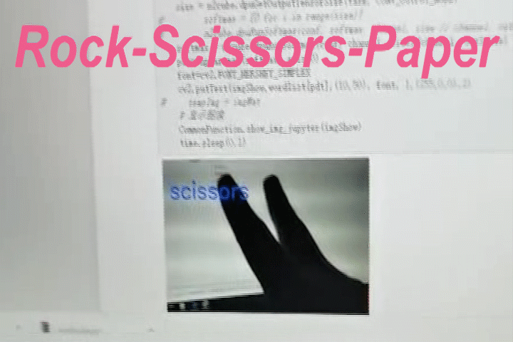
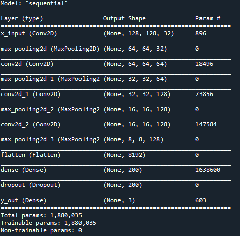

# RpsU96




# Introduction

This project implements the gesture recognition for a common game rock-scissors-paper, including three parts: model training on PC, model compile on Vitis-AI and model calling on Ultra 96. Firstly, a seven layers deep network is trained with tensorflow on PC,  in which the dataset from Google is utilized. Then, the `h5` model generated with `tensorflow 2` is compiled into a `elf` model with Vitis AI docker. The compiled result is able to be run on the edge platform like Ultra96. Finally, a scheme including camera reading, model calling and model validating is implemented with jupyter-notebook on the edge platform.

>  This project is based on PYNQ-DPU, and is compatible with Ultra 96 V2.

## Files in project

```bash
root:[rps_u96]
+--1.compile.sh
+--2.dpuRps.ipynb
+--dataset
+--dataset_valid
+--DpuCar.py
+--imgs
+--prebuilt
|      +--dpu_dpuCarModel_0.elf
|      +--model.h5
+--README.md
+--run
+--train.py
+--vitisAI
|      +--1_vitisAI_keras2frozon.sh
|      +--2_vitisAI_tf_quantize.sh
|      +--3_vitisAI_tf_compile.sh
|      +--dataset_valid
|      +--dpuPynq.dcf
|      +--graph_input_fn.py
|      +--keras_to_tensorflow.py
|      +--model.h5
|      +--u96pynq.json
```

where the key files are shown as follow:

- The network training related file is `train.py`. The trained result will be in res `run` and the dataset used for training is in `dataset`

- The model compile files is in dir `vitsiAI`. The compiled result will be in `vitisAI/compile_result`, the valid data used for quantizing is in `vitisAI/dataset_valid`.

- The main file with edge is in the root, including`1.compile.sh` which translate the `elf` file to `so` model. `2.dpuCar.ipynb` is main program, which can  run under U96 directly. `DpuCar.py` is a dpu helper prepared for `2.dpuCar.ipynb`.

other files:

- img: images used for readme.
- prebuilt: the prebuilt model.


# Model training on PC

## Dataset

The dataset is from google. You can download from the web:

[https://www.tensorflow.org/datasets/catalog/rock_paper_scissors](https://www.tensorflow.org/datasets/catalog/rock_paper_scissors)


## Software environment

The necessary packages:

- python 3.7
- tensorflow 2.0
- numpy
- opencv
- matplotlib
- sklearn

under the anaconda cmd or spyder, run train.py：

```bash
python train.py
```


## Right output

1. the script will output some sample (please check carefully),  and static the distribute of different samples.

   

2. then, the script will print the build network:



3. Show the accuracy during training：

   

4. Print the path for the trained model:

```bash
The trained result is saved on  xxxxxxx\rps_u96\./run/model.h5
```


# Model compile on Vitis-AI 

The trained model is required to be  compiled to the special format for running on the edge platform like Ultra 96.

> How to install the vitis AI: https://github.com/Xilinx/Vitis-AI。
>

1. Copy the trained model `xxx.h5` to the dir of `vitisAI`. If another dataset is captured, please update the `vitisAI/dataset_valid` meanwhile. The smallest valid-dataset is 50.
2. Start vitis AI on docker，copy the dir `vitisAI` to docker.

  ```bash
./docker_run.sh xilinx/vitis-ai
  ```

3. on vitisAI under dockder, activate the environment for tensorflow:

   ```bash
   conda activate vitis-ai-tensorflow
   ```

4. on vitisAI under dockder, firstly, froze the weights to the network.

   ```bash
   ./1_vitisAI_keras2frozon.sh
   ```

   The result is shown as follow:

   ```bash
   ############################################
   Convert keras h5 model to frozon model begin
   Vitis AI 1.1
   ############################################
   ...
   I0613 02:00:10.120678 139970248464192 graph_util_impl.py:334] Froze 12 variables.
   INFO:tensorflow:Converted 12 variables to const ops.
   I0613 02:00:10.169036 139970248464192 graph_util_impl.py:394] Converted 12 variables to const ops.
   I0613 02:00:10.237048 139970248464192 keras_to_tensorflow.py:177] Saved the freezed graph at frozon_result/model.pb
   ############################################
   Convert completed
   ############################################
   ```

   The fixed model will be in `./vitisAI/frozon_result`.

5. on vitisAI under dockder,  then, run the follow script for quantizing model:

   ```bash
   ./2_vitisAI_tf_quantize.sh
   ```

   The result is shown as follow:

   ```bash
   #####################################
   Quantize begin
   Vitis AI 1.1
   #####################################
   INFO: Checking Float Graph...
   INFO: Float Graph Check Done.
   INFO: Calibrating for 50 iterations...
   100% (50 of 50) |########################| Elapsed Time: 0:04:27 Time:  0:04:27
   INFO: Calibration Done.
   INFO: Generating Deploy Model...
   INFO: Deploy Model Generated.
   ********************* Quantization Summary *********************      
   INFO: Output:       
     quantize_eval_model: ./quantize_results/quantize_eval_model.pb       
     deploy_model: ./quantize_results/deploy_model.pb
   #####################################
   QUANTIZATION COMPLETED
   #####################################
   ```

   The quantization result is in `./vitisAI/quantize_results`.

6. on vitisAI under dockder, finally, run the following script for compiling

   ```bash
   ./3_vitisAI_tf_compile.sh
   ```

   The result is shown as follow:

   ```bash
   #####################################
   COMPILE WITH DNNC begin
   #####################################
   **************************************************
   * VITIS_AI Compilation - Xilinx Inc.
   **************************************************
   [VAI_C][Warning] layer [y_out_Softmax] (type: Softmax) is not supported in DPU, deploy it in CPU instead.
   
   Kernel topology "dpuCarModel_kernel_graph.jpg" for network "dpuCarModel"
   kernel list info for network "dpuCarModel"
                                  Kernel ID : Name
                                          0 : dpuCarModel_0
                                          1 : dpuCarModel_1
   
                                Kernel Name : dpuCarModel_0
   --------------------------------------------------------------------------------
                                Kernel Type : DPUKernel
                                  Code Size : 0.02MB
                                 Param Size : 0.46MB
                              Workload MACs : 406.29MOPS
                            IO Memory Space : 0.23MB
                                 Mean Value : 0, 0, 0, 
                         Total Tensor Count : 7
                   Boundary Input Tensor(s)   (H*W*C)
                         x_input_input:0(0) : 128*128*3
   
                  Boundary Output Tensor(s)   (H*W*C)
                          y_out_MatMul:0(0) : 1*1*3
   
                           Total Node Count : 6
                              Input Node(s)   (H*W*C)
                          x_input_Conv2D(0) : 128*128*3
   
                             Output Node(s)   (H*W*C)
                            y_out_MatMul(0) : 1*1*3
   .......
   #####################################
   COMPILATION COMPLETED
   #####################################
   ```

   The compile result is in `./vitisAI/compile_results`, where the file `.elf ` is necessary for the following section.

# Model calling on Ultra 96

1. copy the project the `jupyter_notebook` under the home of Ultra96. If you want to use the new trained model, replace the `elf` file with your one.
2. compile the `elf` model to the shared library.

``` bash
sudo ./1.compile.sh
```
3. under Ultra 96, check the IP address:

```bash
sudo ifconfig
```

4. on a PC under the same LAN with Ultra96, start the browser, type the IP address.  Then, you can enter the jupyter Notebook.
5. on a PC under the same LAN with Ultra96, run cells one by one  and you can find the result.
6. on a PC under the same LAN with Ultra96,  test experiment with prepared valid-dataset：
   
7. on a PC under the same LAN with Ultra96,  real-time experiment with USB camera：


