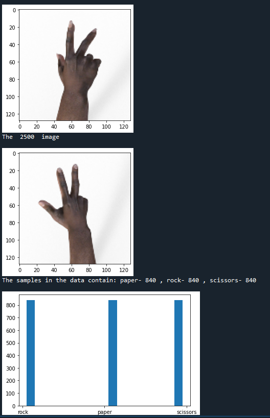
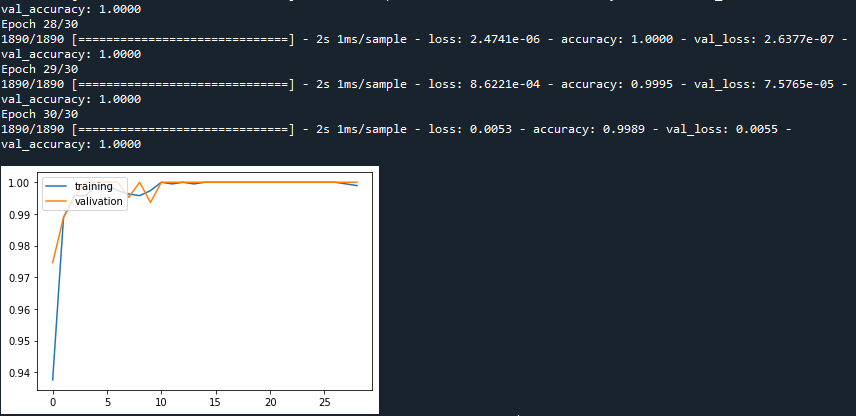
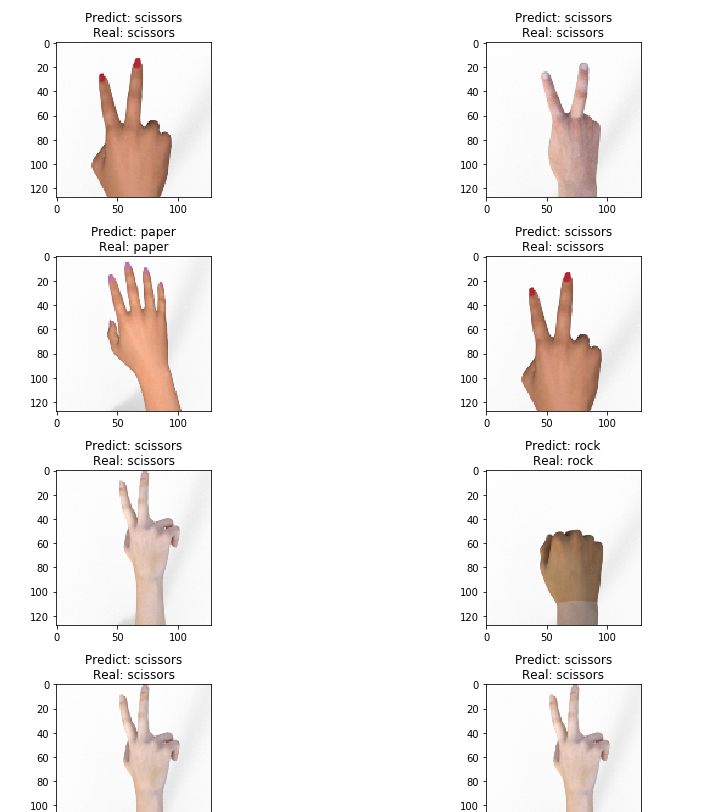

# RpsU96


# 介绍

本案例主要实现一个常见的游戏的手势识别--石头剪刀布。主要分三个部分介绍，分别是PC模型训练、VitisAI模型编译、Edge模型部署三个部分。PC模型训练是通过tensorflow对数据集进行分析训练，得到需要的tf模型；VitisAI模型编译是通过vitis ai工具链，对tf模型进行量化、编译，转换成dpu可以运行的模型；Edge模型部署是在U96上调度使用编译好的模型。

## 案例目录结构

```bash
root:[rps_u96]
+--1.compile.sh
+--2.dpuRps.ipynb
+--dataset
+--dataset_valid
+--DpuCar.py
+--imgs
+--prebuilt
|      +--dpu_dpuCarModel_0.elf
|      +--model.h5
+--README.md
+--run
+--train.py
+--vitisAI
|      +--1_vitisAI_keras2frozon.sh
|      +--2_vitisAI_tf_quantize.sh
|      +--3_vitisAI_tf_compile.sh
|      +--dataset_valid
|      +--dpuPynq.dcf
|      +--graph_input_fn.py
|      +--keras_to_tensorflow.py
|      +--model.h5
|      +--u96pynq.json
```

其中，主要流程相关文件介绍如下：

- PC模型训练相关的文件是`train.py`用于训练深度模型，生成的结果在`run`目录下，训练用的数据集应放在`dataset`目录下。

- VitisAI模型编译相关的目录是`vitsiAI`，生成的结果在`vitisAI/compile_result`，验证用的数据集应房子`vitisAI/dataset_valid`。
- Edge模型部署相关的文件在根目录下，主要有`1.compile.sh`用于将elf模块编译成方便python调用的so模块、`2.dpuCar.ipynb`是主程序、`DpuCar.py`是主程序需要的模块、`dataset_valid`是用于测试模型是否正常的验证集目录。

其他文件介绍如下：

- img目录下存放的是readme等文档中用到的图片。
- prebuilt目录下存放的是我们编译好的可以直接运行的模型。


# PC模型训练教程

### 数据集

数据集使用的是谷歌发布的开源数据集：

[https://www.tensorflow.org/datasets/catalog/rock_paper_scissors](https://www.tensorflow.org/datasets/catalog/rock_paper_scissors)

## 训练环境说明

建议在有显卡的环境下训练，本教程使用的python环境所需的库如下所示：

- python 3.7
- tensorflow 2.0
- numpy
- opencv
- matplotlib
- sklearn

在安装好的python环境下，使用spyder或者命令行运行train.py：

```bash
python train.py
```

## 输出介绍

正常运行时会有以下输出

1. 打印部分数据集图片（注意观察图片是否正常），以及各种标签的样本数量：



2. 输出生成的模型：


3. 打印训练过程以及训练精度的变化：

   

4. 打印生成的模型路径：

```bash
The trained result is saved on  xxxxxxx\DpuCarU96\./run/model.h5
```


# Vitis AI模型编译教程

把训练好的模型通过vitis AI编译后才可以在U96上运行。

> Vitis AI的官方安装教程见: https://github.com/Xilinx/Vitis-AI。
>
> 或者参考我们的在虚拟机下安装vitis-ai的教程：[虚拟机下安装Vitis-AI教程](./doc/1. vitis AI的安装.md)

1. 把训练好的模型拷贝到DpuCarU96的`vitisAI`目录，同时需要把`vitisAI/dataset_valid`下的验证集换成用户自己的数据，至少50张图片。
2. 启动vitis AI的docker，并把工程里的`vitisAI`目录拷贝到docker虚拟机里。

  ```bash
./docker_run.sh xilinx/vitis-ai
  ```

3. 在vitisAI的dockder里，激活tensorflow的环境：

   ```bash
   conda activate vitis-ai-tensorflow
   ```

4. 在vitisAI的dockder里，首先，运行脚本固化权值：

   ```bash
   ./1_vitisAI_keras2frozon.sh
   ```

   结果如下所示：

   ```bash
   ############################################
   Convert keras h5 model to frozon model begin
   Vitis AI 1.1
   ############################################
   ...
   I0613 02:00:10.120678 139970248464192 graph_util_impl.py:334] Froze 12 variables.
   INFO:tensorflow:Converted 12 variables to const ops.
   I0613 02:00:10.169036 139970248464192 graph_util_impl.py:394] Converted 12 variables to const ops.
   I0613 02:00:10.237048 139970248464192 keras_to_tensorflow.py:177] Saved the freezed graph at frozon_result/model.pb
   ############################################
   Convert completed
   ############################################
   ```

   固化完的模型会在`./vitisAI/frozon_result`目录下。

5. 在vitisAI的dockder里，然后，运行脚本量化模型：

   ```bash
   ./2_vitisAI_tf_quantize.sh
   ```

   结果如下所示：

   ```bash
   #####################################
   Quantize begin
   Vitis AI 1.1
   #####################################
   INFO: Checking Float Graph...
   INFO: Float Graph Check Done.
   INFO: Calibrating for 50 iterations...
   100% (50 of 50) |########################| Elapsed Time: 0:04:27 Time:  0:04:27
   INFO: Calibration Done.
   INFO: Generating Deploy Model...
   INFO: Deploy Model Generated.
   ********************* Quantization Summary *********************      
   INFO: Output:       
     quantize_eval_model: ./quantize_results/quantize_eval_model.pb       
     deploy_model: ./quantize_results/deploy_model.pb
   #####################################
   QUANTIZATION COMPLETED
   #####################################
   ```

   量化完的模型在`./vitisAI/quantize_results`目录下。

6. 在vitisAI的dockder里，最后，运行脚本编译模型：

   ```bash
   ./3_vitisAI_tf_compile.sh
   ```

   结果如下所示：

   ```bash
   #####################################
   COMPILE WITH DNNC begin
   #####################################
   **************************************************
   * VITIS_AI Compilation - Xilinx Inc.
   **************************************************
   [VAI_C][Warning] layer [y_out_Softmax] (type: Softmax) is not supported in DPU, deploy it in CPU instead.
   
   Kernel topology "dpuCarModel_kernel_graph.jpg" for network "dpuCarModel"
   kernel list info for network "dpuCarModel"
                                  Kernel ID : Name
                                          0 : dpuCarModel_0
                                          1 : dpuCarModel_1
   
                                Kernel Name : dpuCarModel_0
   --------------------------------------------------------------------------------
                                Kernel Type : DPUKernel
                                  Code Size : 0.02MB
                                 Param Size : 0.46MB
                              Workload MACs : 406.29MOPS
                            IO Memory Space : 0.23MB
                                 Mean Value : 0, 0, 0, 
                         Total Tensor Count : 7
                   Boundary Input Tensor(s)   (H*W*C)
                         x_input_input:0(0) : 128*128*3
   
                  Boundary Output Tensor(s)   (H*W*C)
                          y_out_MatMul:0(0) : 1*1*3
   
                           Total Node Count : 6
                              Input Node(s)   (H*W*C)
                          x_input_Conv2D(0) : 128*128*3
   
                             Output Node(s)   (H*W*C)
                            y_out_MatMul(0) : 1*1*3
   .......
   #####################################
   COMPILATION COMPLETED
   #####################################
   ```

   编译完完的模型在`./vitisAI/compile_results`目录下，里面的`.elf`文件是下一阶段的教程所需要的。

# EDGE端使用教程

## U96镜像安装与预处理

通过以下几种方式准备U96 V2的DPU镜像：

- 安装U96-pynq 2.5 镜像，下载地址：[http://bit.ly/2MMrXcS](http://bit.ly/2MMrXcS)，并参照官方文档对镜像进行升级：[https://github.com/Xilinx/DPU-PYNQ](https://github.com/Xilinx/DPU-PYNQ)。

- 或者参考我们的镜像安装教程：[./doc/2. pynq DPU开箱试用.md](./doc/2. pynq DPU开箱试用.md)
- 或者直接使用我们做好的升级好DPU的U96镜像：

> 链接：https://pan.baidu.com/s/1HPw8meI6W67xHKW58C-Q9g 
> 提取码：x926 
> 复制这段内容后打开百度网盘手机App，操作更方便哦

## U96操作步骤

1. 把仓库拷贝到U96的jupyter_notebook目录下，如果要使用用户的模型，请把里面的.elf文件换成vitisAI教程里生成的elf文件。
2. 在U96的终端上，把elf模型编译程序共享库：

``` bash
sudo ./1.compile.sh
```
3. 在U96的终端上，查看IP地址：

```bash
sudo ifconfig
```

4. 在用户PC上，打开浏览器，输入IP地址，即可进入jupyter Notebook

> 这个用户PC需要和Ultra96在同一个局域网下。

4. 在用户PC上，按照jupyterNotebook的提示逐步地运行程序，即可看到效果
5. 在用户PC上，使用采集好的验证数据对DPU模型进行测试：
   
6. 在用户PC上，使用USB摄像头的实时识别实验。USB摄像头需要连接在Ultral96上。


