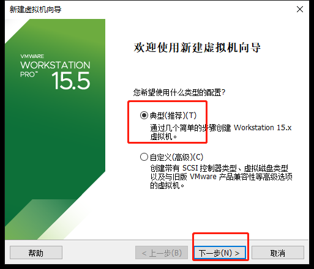
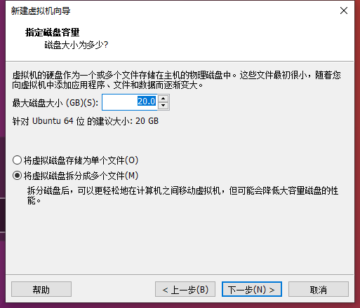
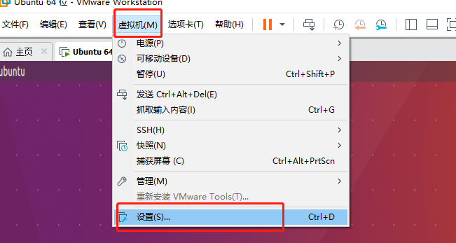
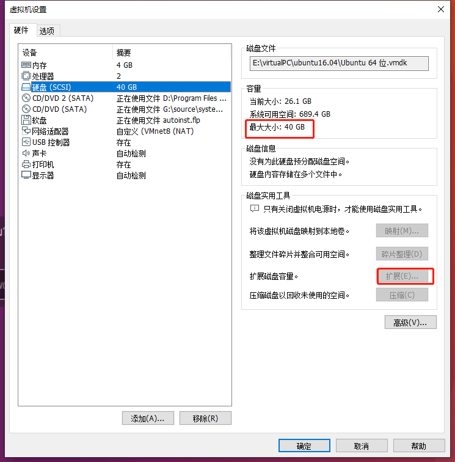

# 1. vitis AI的安装

## 简介
Vitis AI

### 安装环境
- windows 10
- VMware 15.5
- Vitis AI 1.1
- ubuntu 16.04

## 安装过程

### 在VMware中安装ubuntu 16.04

1. 添加虚拟机



2. 选择下载的镜像


镜像可以在这里下载：
[http://mirrors.aliyun.com/ubuntu-releases/16.04/](http://mirrors.aliyun.com/ubuntu-releases/16.04/)

3. 然后一直下一步即可完成安装，安装完成后会自动启动ubuntu 16.04，看到下面这个熟悉的界面代表成功安装了虚拟机


**这里有几个注意点**
- Vitis AI需要比较大的空间，建议在新建虚拟机的时候选择40Gb的硬盘容量。
      


- 如果安装的时候只选择了20Gb的硬盘容量怎么办？没有关系，可以通过以下方法扩展虚拟机的硬盘容量：
    1. 关闭正在的运行的虚拟机，选择虚拟机->设置


    2. 点击磁盘选项下的拓展按钮可以拓展磁盘容量


    3. 但是！这个容量并没有被划到‘/’分区下，也就无法使用，这个时候需要修改分区，首先安装Gparted
  ```bash
  sudo apt-get install gparted
  ```

     4. 启动Gparted后会发现无法修改分区，这是因为现在交换内存正在使用，所以分区被锁定。如图所示：


     5. 使用以下指令同步磁盘数据并关闭交换内存
  ```bash
  sync
  echo 3 > /proc/sys/vm/drop_caches
  swapoff -a
  gparted
  ```
     6. 然后就可以修改磁盘空间了，先把最后两个磁盘删掉，然后拓展磁盘空间（注意预留交换内存的空间），再新建交换空间。保存后重新启动交换空间，搞定。
 

### 安装Vitis AI
1. 安装Git
  ```bash
 sudo apt-get install git
  ```

2. 启动一个终端，找一个你喜欢的目录（注意不要有中文和空格）。从Github克隆vitis ai的仓库。
    ```bash
    git clone https://github.com/Xilinx/Vitis-AI.git
    ```
   如果发现下载的速度非常慢怎么办（vitis ai的源码有920Mb），没关系，我把它镜像到了Gitee。在国内从Gitee可以很快地克隆仓库：
   ```bash
    git clone https://gitee.com/xiaobolin/Vitis-AI.git
   ```

3. 进入克隆好的文件夹，使用以下指令拉取最新的docker镜像
  ```bash
./docker_run.sh xilinx/vitis-ai
  ```
  这条指令也用于以后启动vitis AI。第一次启动需要下载大概20Gb的文件，请耐心等待。


4. 安装成功后可以看到以下提示：

其中的3条conda指令用于在docker环境下启动相应流程（Caffe、tensorflow和neptune）的虚拟环境。

### 几个常见的docker指令
1.  docker ps -a 查看容器
```bash
root@ubuntu:/home/xilinx# docker ps
CONTAINER ID        IMAGE               COMMAND                CREATED             STATUS              PORTS               NAMES
ae565bc6ad65        xilinx/vitis-ai     "/etc/login.sh bash"   9 minutes ago       Up 9 minutes                            keen_grothendieck

```

这里的NAMES对应的keen_grothendieck就是容器的名称，在主机和容器进行交互需要指定容器名称

2.  从主机到容器拷贝文件

```
docker cp /opt/test/file.txt mycontainer:/workspace

```
mycontainer应该替换成容器名称。

3.  从容器到主机拷贝文件
```
docker cp mycontainer:/opt/testnew/file.txt /opt/test/

```
mycontainer应该替换成容器名称。

> -  无论容器有没有启动，拷贝命令均会生效。
> *   使用管理员权限启动的容器，需要使用管理员权限才能拷贝文件。


