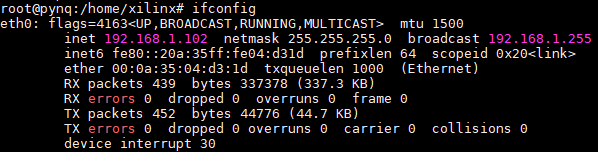
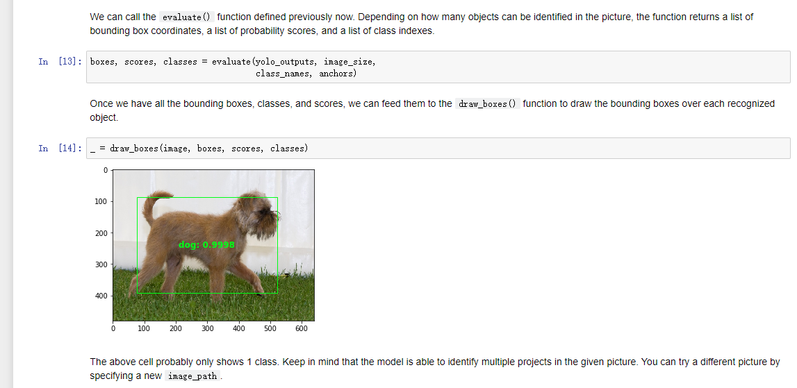

# pynq DPU开箱试用

## 简介

## 材料需求

1. U96开发板，SD卡
2. 网线、电源线、microUSB数据线
3. U96-pynq2.5镜像，在这里下载：[http://bit.ly/2MMrXcS](http://bit.ly/2MMrXcS)
4. pynq-dpu仓库，在这里下载：[https://github.com/Xilinx/DPU-PYNQ](https://github.com/Xilinx/DPU-PYNQ)

## 镜像安装与升级

1. 使用win32DiskImager将U96-pynq2.5的镜像烧写到SD卡里。win32DiskImager的下载地址：[https://sourceforge.net/projects/win32diskimager/](https://sourceforge.net/projects/win32diskimager/)


2. 把烧好的sd卡插入U96并启动，使用microUSB数据线连接U96与PC，启动后可以在PC上看到PYNQ的启动自检：

> pynq的admin账户是xilinx，密码也是xilinx

3. 使用ifconfig查看系统的IP，并使用以太网ssh的方式登录pynq。

```bash
ssh xilinx@192.168.1.102
```

4. 登录之后可以使用scp将下好的pynq-dpu仓库（记得要包含子模块）上传上去。

或者使用git指令下载pynq-dpu仓库：
```bash
git clone --recursive --shallow-submodules https://github.com/Xilinx/DPU-PYNQ.git
```

5. 解压或下载后，进入upgrade目录，使用以下指令进行升级:

```bash
cd DPU-PYNQ/upgrade 
make 
pip3 install pynq-dpu
```

> 这个过程大概需要40分钟，最后一条指令有时候会卡住，多试几次总会成功的

6. 获取pynq-dpu的案例

```bash
cd  $PYNQ_JUPYTER_NOTEBOOKS 
pynq get-notebooks pynq-dpu -p .
```

## 案例测试

### YOLO 测试与代码讲解

1. 打开一个网页，在上面输入ip地址来访问jupyter，如`192.168.1.102`

2. 准备Overlay，包含fpga上运行bit文件和在dpu上运行的elf文件。通过pynq的dpu库加载这两个文件后，pynq-dpu会自动根据模型生成共享库并给python调用。
```python
from pynq_dpu import DpuOverlay
overlay = DpuOverlay("dpu.bit")
overlay.load_model("dpu_tf_yolov3.elf")

import numpy as np
import random
import cv2
import colorsys
from PIL import Image
from matplotlib.patches import Rectangle
import matplotlib.pyplot as plt
%matplotlib inline
from pynq_dpu.edge.dnndk.tf_yolov3_voc_py.tf_yolov3_voc import *
```

3. 初始化深度网络的参数，如YOLO3的预选框、类别：

```python
# 预选框
anchor_list = [10,13,16,30,33,23,30,61,62,45,59,119,116,90,156,198,373,326]
anchor_float = [float(x) for x in anchor_list]
anchors = np.array(anchor_float).reshape(-1, 2)
# 类别
classes_path = "img/voc_classes.txt"
class_names = get_class(classes_path)
# 为每种类别选择一种颜色
num_classes = len(class_names)
hsv_tuples = [(1.0 * x / num_classes, 1., 1.) for x in range(num_classes)]
colors = list(map(lambda x: colorsys.hsv_to_rgb(*x), hsv_tuples))
colors = list(map(lambda x: 
                  (int(x[0] * 255), int(x[1] * 255), int(x[2] * 255)), 
                  colors))
random.seed(0)
random.shuffle(colors)
random.seed(None)
```

4. 初始化elf模型参数，如网络输出输入节点的名称

```python
KERNEL_CONV="tf_yolov3"
CONV_INPUT_NODE="conv2d_1_convolution"
CONV_OUTPUT_NODE1="conv2d_59_convolution"
CONV_OUTPUT_NODE2="conv2d_67_convolution"
CONV_OUTPUT_NODE3="conv2d_75_convolution"
```

5. 初始化画预测框、类别翻译等后处理函数

```python
def draw_boxes(image, boxes, scores, classes):
    _, ax = plt.subplots(1)
    ax.imshow(cv2.cvtColor(image, cv2.COLOR_BGR2RGB))
    image_h, image_w, _ = image.shape

    for i, bbox in enumerate(boxes):
        [top, left, bottom, right] = bbox
        width, height = right - left, bottom - top
        center_x, center_y = left + width*0.5, top + height*0.5
        score, class_index = scores[i], classes[i]
        label = '{}: {:.4f}'.format(class_names[class_index], score) 
        color = tuple([color/255 for color in colors[class_index]])
        ax.add_patch(Rectangle((left, top), width, height,
                               edgecolor=color, facecolor='none'))
        ax.annotate(label, (center_x, center_y), color=color, weight='bold', 
                    fontsize=12, ha='center', va='center')
    return ax

def evaluate(yolo_outputs, image_shape, class_names, anchors):
    score_thresh = 0.2
    anchor_mask = [[6, 7, 8], [3, 4, 5], [0, 1, 2]]
    boxes = []
    box_scores = []
    input_shape = np.shape(yolo_outputs[0])[1 : 3]
    input_shape = np.array(input_shape)*32

    for i in range(len(yolo_outputs)):
        _boxes, _box_scores = boxes_and_scores(
            yolo_outputs[i], anchors[anchor_mask[i]], len(class_names), 
            input_shape, image_shape)
        boxes.append(_boxes)
        box_scores.append(_box_scores)
    boxes = np.concatenate(boxes, axis = 0)
    box_scores = np.concatenate(box_scores, axis = 0)

    mask = box_scores >= score_thresh
    boxes_ = []
    scores_ = []
    classes_ = []
    for c in range(len(class_names)):
        class_boxes_np = boxes[mask[:, c]]
        class_box_scores_np = box_scores[:, c]
        class_box_scores_np = class_box_scores_np[mask[:, c]]
        nms_index_np = nms_boxes(class_boxes_np, class_box_scores_np) 
        class_boxes_np = class_boxes_np[nms_index_np]
        class_box_scores_np = class_box_scores_np[nms_index_np]
        classes_np = np.ones_like(class_box_scores_np, dtype = np.int32) * c
        boxes_.append(class_boxes_np)
        scores_.append(class_box_scores_np)
        classes_.append(classes_np)
    boxes_ = np.concatenate(boxes_, axis = 0)
    scores_ = np.concatenate(scores_, axis = 0)
    classes_ = np.concatenate(classes_, axis = 0)

    return boxes_, scores_, classes_
```

6. 初始化原始图像

```python
image_path = "img/irishterrier-696543.JPEG"
image = cv2.imread(image_path)
_, ax = plt.subplots(1)
_ = ax.imshow(cv2.cvtColor(image, cv2.COLOR_BGR2RGB))

image_size = image.shape[:2]
image_data = np.array(pre_process(image, (416, 416)), dtype=np.float32)
```

7. 运行模型，通过n2cube库加载elf核，运行DPU核得到网络输出的结果
```python
n2cube.dpuOpen()
kernel = n2cube.dpuLoadKernel(KERNEL_CONV)
task = n2cube.dpuCreateTask(kernel, 0)

input_len = n2cube.dpuGetInputTensorSize(task, CONV_INPUT_NODE)
n2cube.dpuSetInputTensorInHWCFP32(
    task, CONV_INPUT_NODE, image_data, input_len)

n2cube.dpuRunTask(task)

conv_sbbox_size = n2cube.dpuGetOutputTensorSize(task, CONV_OUTPUT_NODE1)
conv_out1 = n2cube.dpuGetOutputTensorInHWCFP32(task, CONV_OUTPUT_NODE1, 
                                               conv_sbbox_size)
conv_out1 = np.reshape(conv_out1, (1, 13, 13, 75))

conv_mbbox_size = n2cube.dpuGetOutputTensorSize(task, CONV_OUTPUT_NODE2)
conv_out2 = n2cube.dpuGetOutputTensorInHWCFP32(task, CONV_OUTPUT_NODE2, 
                                               conv_mbbox_size)
conv_out2 = np.reshape(conv_out2, (1, 26, 26, 75))

conv_lbbox_size = n2cube.dpuGetOutputTensorSize(task, CONV_OUTPUT_NODE3)
conv_out3 = n2cube.dpuGetOutputTensorInHWCFP32(task, CONV_OUTPUT_NODE3, 
                                               conv_lbbox_size)
conv_out3 = np.reshape(conv_out3, (1, 52, 52, 75))

yolo_outputs = [conv_out1, conv_out2, conv_out3]   
```

8. 后处理，得到结果：

```python
boxes, scores, classes = evaluate(yolo_outputs, image_size, 
                                  class_names, anchors)
_ = draw_boxes(image, boxes, scores, classes)
```



9. 运行完要释放资源

```python
n2cube.dpuDestroyTask(task)
n2cube.dpuDestroyKernel(kernel)
```
